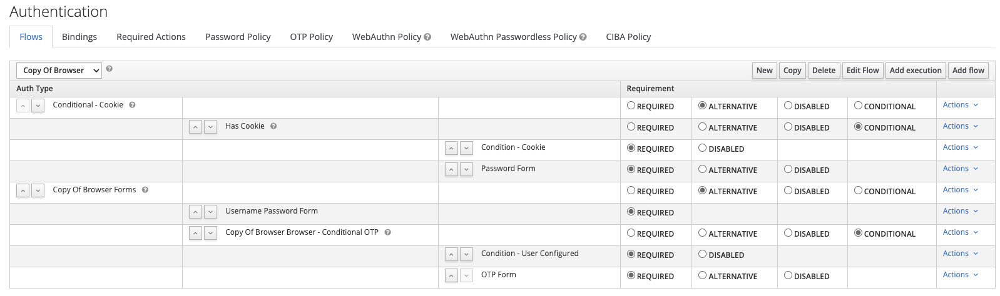

# Conditional cookie authenticator

## Build

```
mvn clean install
```

## Deployment

Copy generated JAR in deployment directory

## Usage



This conditional authenticator allows an authentication flow that asks an already authenticated user for a secret such as a password, OTP or webauthn key.